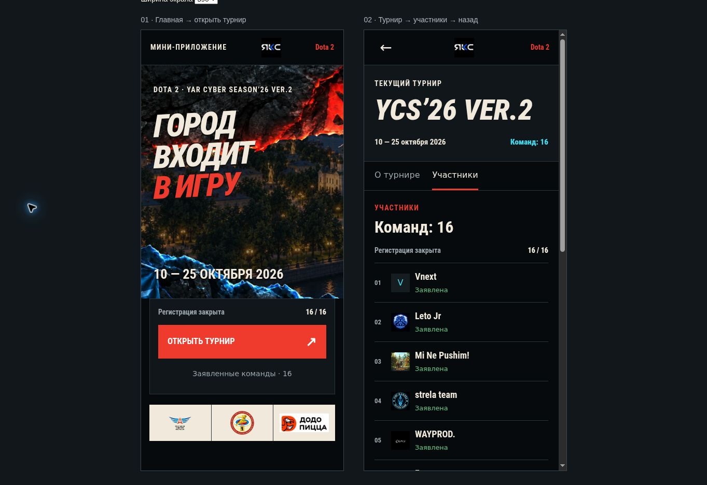

# Шаг 5/8 — совместная проверка Mini App

Статус на 15.09.2026: подготовлено, совместная приёмка НЕ выполнена.

## Какая версия проверяется

- Ветка: `codex/telegram-miniapp`.
- Код/данные: commit `a60052e131cb8fb770a51e3c4a8260cf957dc22c`.
- Два экрана: `/tg` и `/tg/tournament`, только Dota `dota2-autumn-2026`, 10–25 октября 2026.
- «Разлом» и русский; переключатели скрыты до второго доступного варианта. Реестры и сохранение предпочтений остаются.
- Новые документы и проверочный скрипт не меняют приложение этой версии.
- Main на момент сверки: `58c9754f7035d04a24ad8dcc511988705d015537`. Его новые меню, страницы и регламент не объединялись в закреплённую сборку. Перед выпуском потребуется интеграция актуального main с повторными проверками; этот пакет нельзя публиковать поверх нового сайта как готовый релиз.

## Что можно открыть

Рабочая ссылка для телефона/Telegram пока **не подготовлена**: нет согласованного тестового HTTPS-адреса, выбранного бота и разрешения на размещение/настройку. Существующий опубликованный Site не идентифицирован как эта сборка; его URL не выдаётся за Mini App preview.

В данной среде локальный QA-preview внутренний, не пользовательская ссылка. Публичный deploy Sites — production, поэтому он не используется для обхода согласования. Новый Site, туннель или бот не создаются.

Сохранённый снимок интерфейса шага 4 — ориентир, а не интерактивная проверка:



После получения разрешения исполнитель размещает именно согласованный набор в указанной тестовой среде, проверяет HTTPS и байты JS/CSS и только затем передаёт Роману фактические ссылки:

| Назначение | Путь относительно согласованного HTTPS origin |
| --- | --- |
| Главная | `/tg` |
| Прямой вход в участников | `/tg/tournament?section=participants` |
| Браузерная проверка startapp | `/tg?startapp=participants` |

Это пути, не готовые ссылки. Для настоящего Telegram используется фактическая ссылка выбранного и настроенного бота; её нельзя составлять из придуманного username/short name. Браузерный параметр не доказывает работу Telegram start_param.

## Короткий проход вместе с Романом

До начала записать код сборки, фактический URL, ОС/устройство, версию Telegram или браузера, viewport/ориентацию, сеть и дату. Не записывать bot token, initData и персональные идентификаторы Telegram.

| № | Действие Романа | Что вместе наблюдаем | Факт |
| --- | --- | --- | --- |
| 1 | Открыть главную | Dota 2, 10–25 октября, 16/16, регистрация закрыта, «Разлом», русский | НЕ ПРОВЕРЕНО |
| 2 | «Открыть турнир» → «Участники» | Все 16 команд; список ниже совпадает с интерфейсом | НЕ ПРОВЕРЕНО |
| 3 | Нажать «Назад» | Главная Mini App, без перехода в архив/страницу команды | НЕ ПРОВЕРЕНО |
| 4 | Открыть прямую ссылку на участников → «Назад» | Правильный турнир и возврат на `/tg`, даже без истории главной | НЕ ПРОВЕРЕНО |
| 5 | Открыть launch участников → назад → перезагрузить | Участники открылись один раз; после возврата reload не уводит туда снова | НЕ ПРОВЕРЕНО |
| 6 | Закрыть и повторно открыть приложение обычным запуском | Нет зависания/двойного перехода; русский и «Разлом» сохранены | НЕ ПРОВЕРЕНО |
| 7 | Просмотреть на телефоне, прокрутить до конца, повернуть экран | Текст/кнопки доступны; нет горизонтального скролла, наложений и обрезанных участников | НЕ ПРОВЕРЕНО |
| 8 | Запустить из настоящего Telegram | Контент загружается, Telegram BackButton возвращает домой и скрывается там | НЕ ПРОВЕРЕНО |
| 9 | Свернуть/развернуть Telegram, изменить высоту и ориентацию | Нет перекрытия кнопками Telegram/вырезом/нижней системной областью; последний участник доступен | НЕ ПРОВЕРЕНО |

На Android, iOS, Desktop результаты вести раздельно; недоступный клиент не получает PASS от проверки другого. Полная матрица и 24 сценария относятся к шагу 7. Для шага 5 обязательно реальное совместное наблюдение в доступном клиенте Telegram, фиксация оставшихся сред и явное подтверждение Романа.

Фактический порядок из JSON закреплённой сборки: Vnext; Leto Jr; Mi Ne Pushim!; strela team; WAYPROD.; Fummo; TEAM SPERMINT; ARB Esports; PIVNAYA KEGA; Tech Titans; Easy Gaming; Team Borisogleb; parallax team; liqa sto; psb_bank; РГАТУ. Регистр `psb_bank` сохранён из источника, не исправлен догадкой. Матчей 0; пустые слоты не считаются результатами.

Другие разделы ещё готовятся — это известная граница шага 4, не причина начинать шаг 6 до приёмки. Не обещать полный турнир/обновление версии.

## Как фиксируем замечание и закрываем шаг

Для каждого отклонения: номер сценария → шаги → ожидаемое → фактическое → скриншот без личных данных → версия/устройство. Исполнитель воспроизводит дефект, исправляет только затронутый сценарий, сохраняет новую версию и повторяет проверки. При смене кода старая идентичность сборки и её evidence не переносятся автоматически.

Шаг закрывает только явное подтверждение Романа после совместного прохода. Сейчас подтверждения нет. Успех unit/SSR/build, снимок и согласие verifier не заменяют его. До закрытия — шаг 5, без перехода к 6.

## Воспроизводимая подготовительная проверка для исполнителя

В том же checkout, не создавая второй repo/Site: сначала проверить `git status`, remote miniapp/main и соответствие закреплённому source. Не переключать/сбрасывать грязное дерево. Затем выполнить:

```sh
npm run build
node --test tests/*.test.mjs
node scripts/telegram-review-check.mjs
```

Если зависимостей нет, восстановить по lockfile через `npm ci --ignore-scripts --no-audit --no-fund`. Скрипт проверяет совпадение исходников/готовых miniapp JS/CSS с a60052e, Sites identity и фактические данные; печатает evidence без записи или внешних действий. Это НЕ клиентский manifest шага 6 и НЕ browser/Telegram test. При несовпадении завершает работу ошибкой; не обновлять эталон только ради PASS.

Для продолжения нужны: выбранный `@bot`, согласованный тестовый HTTPS-адрес/площадка и явное разрешение на конкретное тестовое размещение и необходимую настройку этого бота. Токен в переписке не требуется. Production, аудитория основного сайта и состояние внешней регистрации не меняются.
